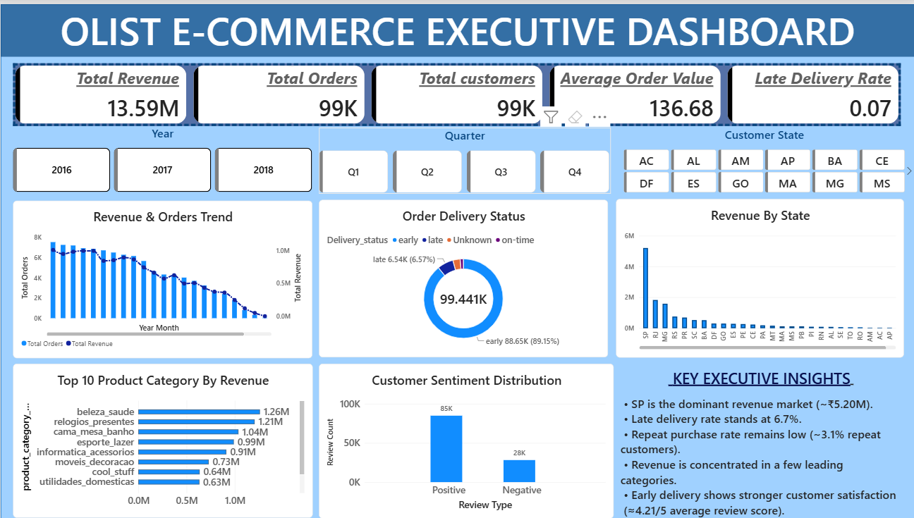
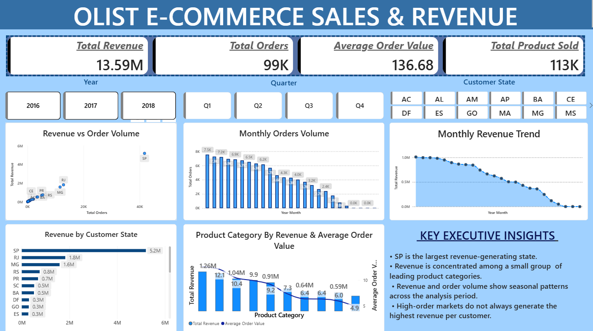
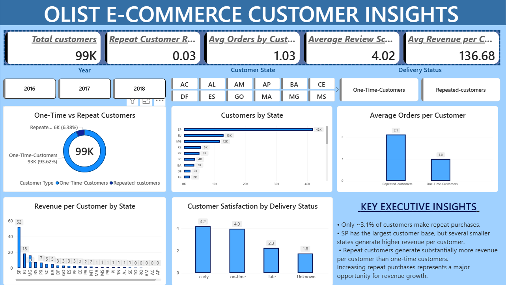
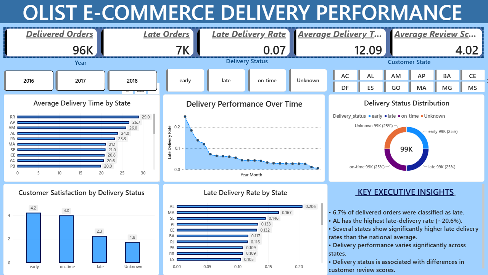
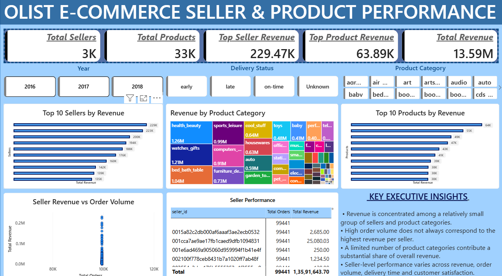

# 🛒 Olist E-Commerce Analytics

## Power BI | Python | Pandas | DAX | Data Analytics

An end-to-end e-commerce analytics project using the Olist dataset to analyze sales performance, customer behavior, delivery efficiency, product performance, and seller performance.

The project combines **Python-based data cleaning and exploratory analysis** with **Power BI data modeling, DAX, and interactive dashboard development**.

---

# 📊 Dashboard Preview

## Executive Dashboard



## Sales & Revenue



## Customer Insights



## Delivery Performance



## Seller & Product Performance


---

# 🎯 Project Objective

The objective of this project is to analyze Olist e-commerce transactions and generate actionable business insights across:

- Sales and revenue
- Customer behavior
- Customer retention
- Delivery performance
- Product categories
- Seller performance
- Geographic performance
- Customer satisfaction

The final result is an interactive **five-page Power BI dashboard** designed for executive and business analysis.

---

# ❓ Business Questions

### Sales & Revenue

- How is revenue changing over time?
- Which states generate the highest revenue?
- Which product categories generate the most revenue?
- Does high order volume always translate into high revenue?

### Customer Analysis

- How many customers make repeat purchases?
- What is the repeat customer rate?
- Which states generate the highest revenue per customer?
- How does purchasing frequency differ between customer segments?

### Delivery Analysis

- What percentage of orders are delivered late?
- Which states have the highest late-delivery rates?
- Which states have the longest delivery times?
- Does delivery performance affect customer satisfaction?

### Seller & Product Analysis

- Which sellers generate the most revenue?
- Which products and categories contribute the most revenue?
- Does seller order volume correspond to seller revenue?
- Which sellers perform strongly across revenue, delivery, and customer satisfaction?

---

# 🛠️ Tools & Technologies

| Tool | Purpose |
|---|---|
| Python | Data cleaning and analysis |
| Pandas | Data manipulation |
| NumPy | Numerical analysis |
| Matplotlib | Data visualization |
| Seaborn | Exploratory visualization |
| Power BI | Interactive dashboard |
| DAX | KPI and analytical measures |
| Git & GitHub | Version control and portfolio |

---

# 📈 Key KPIs

| KPI | Result |
|---|---:|
| Total Revenue | ~₹13.59M |
| Total Orders | ~99.44K |
| Unique Customers | ~96.10K |
| Total Sellers | 3,095 |
| Total Products | 32,951 |
| Average Order Value | ~₹136.68 |
| Delivered Orders | ~96.48K |
| Late Orders | ~6.54K |
| Late Delivery Rate | ~6.7% |
| Repeat Customers | ~2,997 |
| Repeat Customer Rate | ~3.1% |

> **Note:** The original Olist dataset is denominated in Brazilian reais (BRL). Currency labeling should be adjusted if a currency conversion is applied.

---

# 🔍 Key Business Insights

### 1. Revenue Concentration

São Paulo (SP) is the largest revenue-generating state, contributing approximately **₹5.20M** in the project analysis.

### 2. Customer Retention Opportunity

Approximately **3.1% of customers are repeat customers**, indicating a significant opportunity to improve customer retention.

The analysis identified:

- 93,099 one-time customers
- 2,997 repeat customers

Repeat customers also place more orders per customer than one-time customers.

### 3. Delivery Performance

Approximately **6.7% of delivered orders were classified as late**.

AL recorded the highest late-delivery rate at approximately **20.58%** and an average delivery time of approximately **23.99 days**.

### 4. Customer Value

Several smaller states generate higher revenue per customer than large customer markets.

This demonstrates that **customer volume and customer value are not necessarily the same**.

### 5. Product Performance

Revenue is concentrated among leading product categories, making category-level analysis important for assortment, promotion, and growth decisions.

### 6. Seller Performance

Seller performance should not be evaluated using revenue alone.

Order volume, revenue, average order value, delivery performance, and customer satisfaction should be considered together.

---

# 📊 Power BI Dashboard

The Power BI dashboard contains five analytical pages:

### Page 1 — Executive Dashboard

Provides a high-level overview of:

- Revenue
- Orders
- Customers
- Average Order Value
- Delivery performance
- Product categories
- Customer satisfaction

### Page 2 — Sales & Revenue

Analyzes:

- Revenue trends
- Order volume
- Product categories
- Revenue by state
- Revenue vs order volume

### Page 3 — Customer Insights

Analyzes:

- Customer distribution
- Repeat customers
- Customer value
- Orders per customer
- Customer satisfaction

### Page 4 — Delivery Performance

Analyzes:

- Delivery status
- Late delivery rate
- Average delivery time
- State-level delivery performance
- Delivery trends
- Customer satisfaction

### Page 5 — Seller & Product Performance

Analyzes:

- Top sellers
- Top products
- Product categories
- Seller revenue
- Seller order volume
- Seller performance

---

# 🧹 Data Analysis Workflow

```text
Raw Olist Dataset
        ↓
Data Cleaning
        ↓
Exploratory Data Analysis
        ↓
Feature Engineering
        ↓
Business Analysis
        ↓
Data Integration
        ↓
Power BI Data Model
        ↓
DAX Measures
        ↓
Interactive Dashboard
        ↓
Business Recommendations